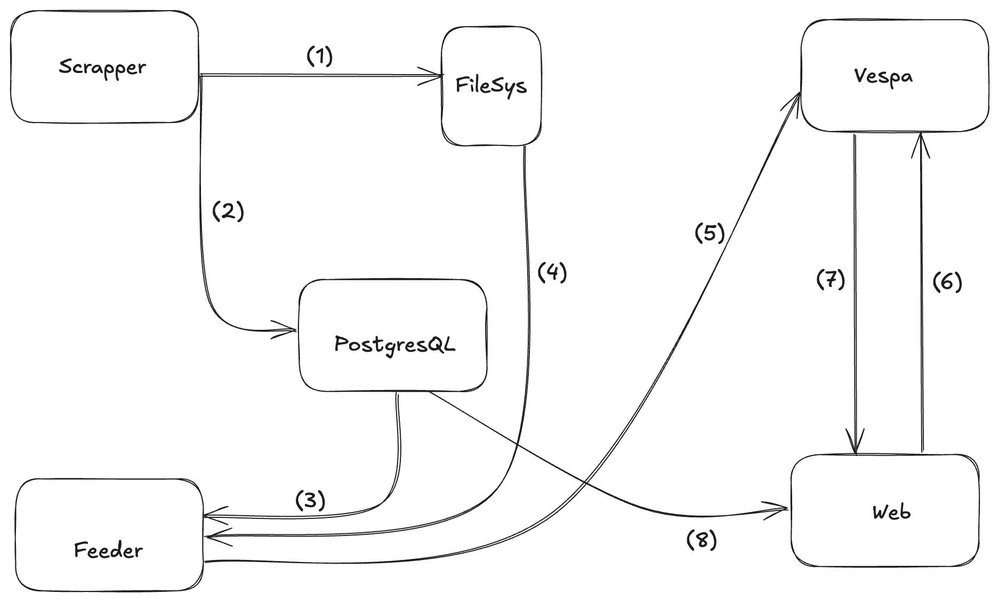

### Kode Search - Programming documentation search app

Search app build around Vespa search-engine that indexes some popular programming documentation and blogs.

### Architecture

KodeSearch is build with the help of `docker-compose`, there are multiple components in this project. Those are as follows:

1. Scrapper: Uses `scrapy` to crawl and scrap content from web pages.
2. PostgresQL as DB: Used to store and keep track of scrapped files.
3. Vespa Engine: Main component that indexes and store the content for user queries.
4. Feeder: This components feeds data to Vespa, the data which`scrapper` downloads.
5. Web - RoR app: Simple web app that provides interface to user for querying Vespa.

#### Data Flow


1. After `scrapper` scrapes web pages, it stores them on the file system.
2. `scrapper` stores the file info in the DB, using it as a queue this is used by feeder.
3. `feeder` reads file info that are ready to be fed to `vespa`.
4. `feeder` reads the actual file content.
5. `feeder` feeds the data to `vespa`
6. User queries `vespa` via `web`
7. `vespa` returns results to the user query back to `web`
8. `web` request scrapped domain list from `postgresql-db`


## Installation

As I previously mentioned this project utalizes `docker-compose` so the installation quite easy.

1. Clone the project.
2. 
```sh
    cp .env.example .env
```
3. Set the variables inside `.env`
4. 
```sh 
docker-compose build
```
5. We will star the containers one-by-one
```sh
#1
docker-compose up scrapper -d

#2
docker-compose up vespa -d
# Vespa will take sometime to start.


# run the script that will deploy vespa package to the container
./vespa/deploy-and-start.sh

#3 once vespa is ready to accept data, run the feeder

docker-compose up feeder -d

#4 
docker-compose up web -d
```